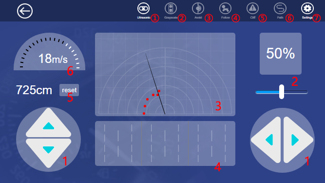

Boot Web Control
=================

Input the command and start up the web control program.

.. code-block:: python

    cd /home/pi/picar-4wd/
    picar-4wd web-example

As the program is running, on the browser, type the IP of the Raspberry Pi, and you can enter the Web interface. 

Interface Introduction
------------------------

1. Arrow Key
2. Power Regulator
3. Obstacle Monitor: checking the obstacle ahead within 35cm and 180°. Red dot represents there is an obstacle ahead detected by ultrasonic module.
4. Grayscale Monitor: displaying the color condition of the detected surface. If the module detects the black lines and then the cliff, the different colors will display on the monitor.
5. Mileage
6. Speed Monitor
   
① Ultrasonic: turning on/off the obstacle monitor and the ultrasonic measurement function.

② Grayscale: turning on/off the grayscale monitor and the line following function.

③ Avoid: turning on/off obstacle avoidance function can make the car get around the obstacles automatically or not. 

④ Follow: turning on/off line following function can let the car follow the objects ahead or not.

⑤ Cliff: turn on/off edge detection. The car retreats once it detects the cliff or not. **If the car doesn’t realize the effect, please adjust the threshold on the setting page**.

⑥ Path: to turn on/off line following function. Once you start up the line following function, the car will drive along the black lines on the ground. **If not, please adjust the threshold on the setting page**.

⑦ Setting: You can enter the Setting page by clicking this one. 

