Hardware Assembling
======================

Assembling Motor
------------------

Assemble 4 motor to the bottom plate.

.. note::
    Keep the vertex angle of the triangle sticking upward.

    For the convenience of later assembly, please mark the number(1, 2, 3, 4) on the socket of the 4 motors. 

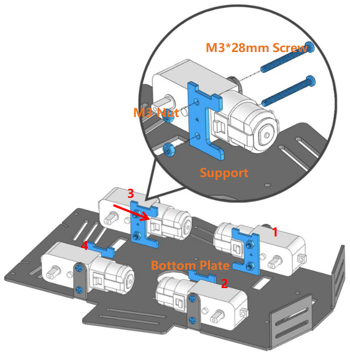

Photo-interrupter Module + Encoding Disk
-------------------------------------------

Insert the Encoding Disk into the motor, then assemble the Photo-interrupter module from bottom to top.

.. note::
    Keep the Encoding Disk on the motor away from the Photo-interrupter module to avoid the potential abrasion.

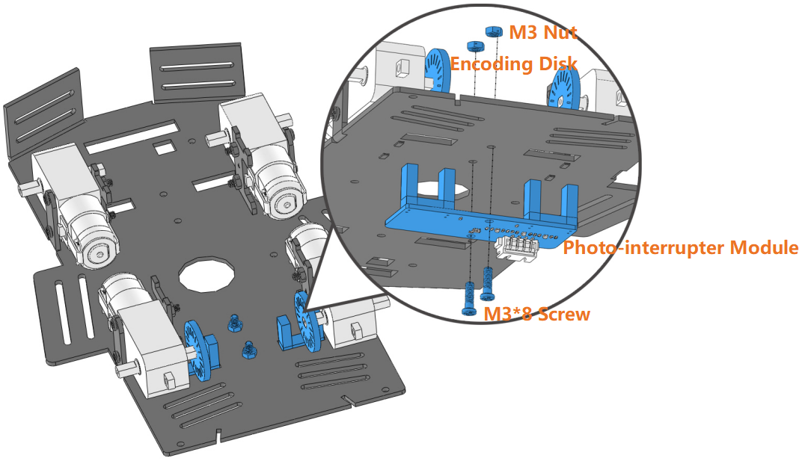

Assembling Grayscale Sensor Module
---------------------------------------

Have the Grayscale sensor module be under the head of the car.

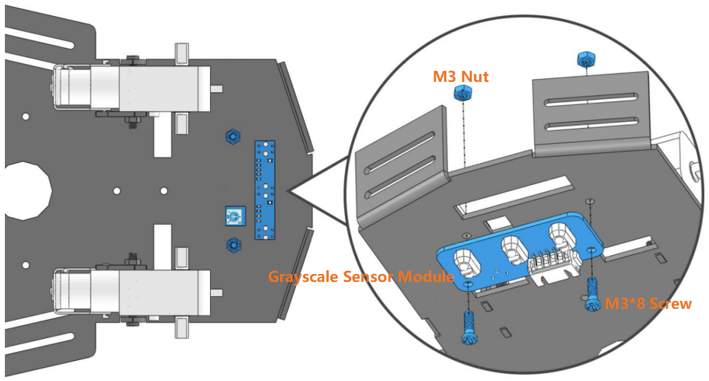

Assembling Battery Holder
-----------------------------

Assemble the battery holder to the top plate and put the battery in.

.. note::
    To get the battery out of the holder easily, you can wind the battery with ribbon like this. 

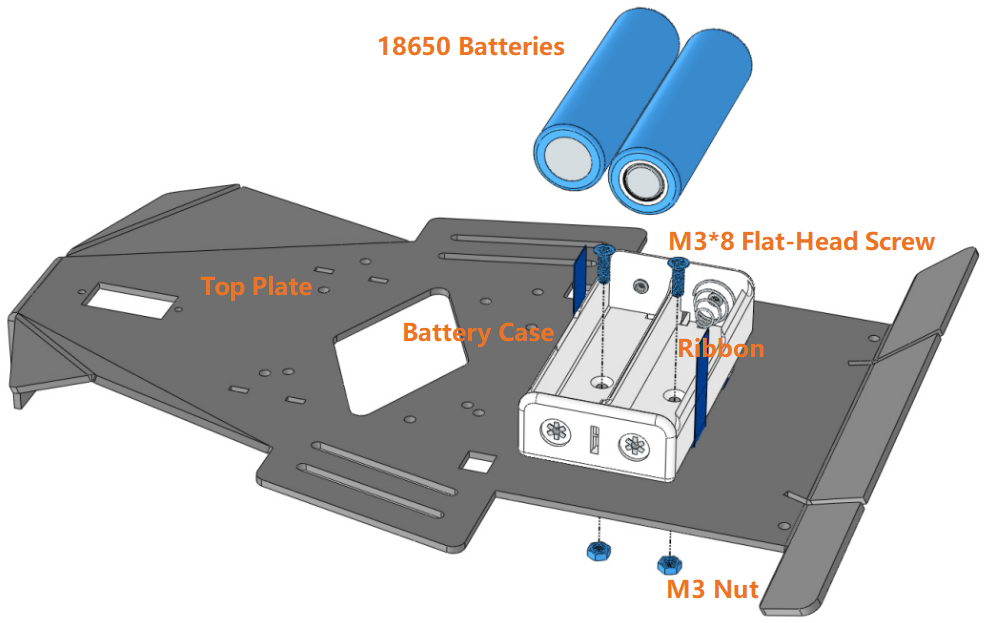

Assembling Servo
---------------------

Assemble the servo from bottom to top.

.. note::
    The output axis is to face outwards.

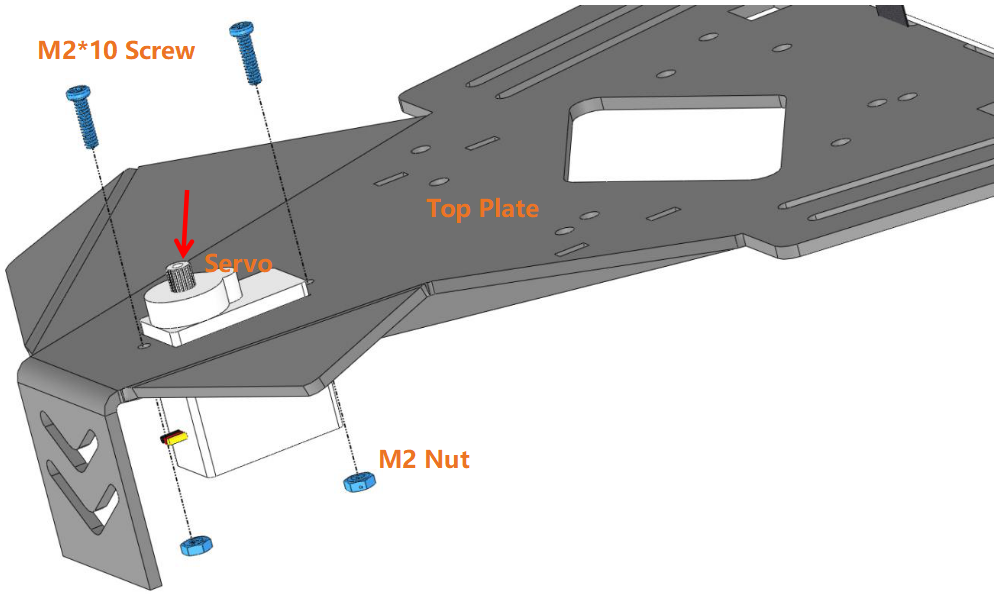

Assembling Nylon Standoffs
---------------------------

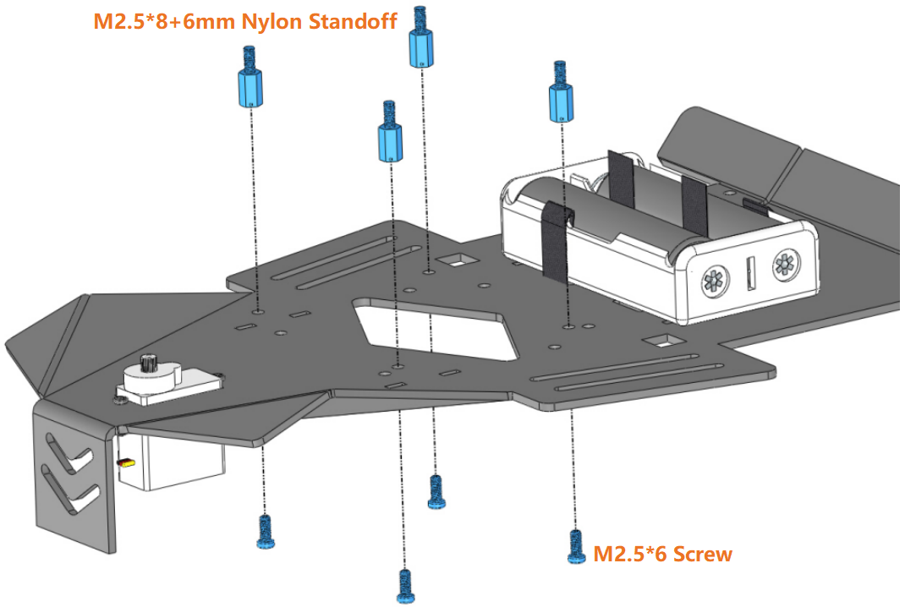

Assembling Top Plate and Bottom Plate
---------------------------------------

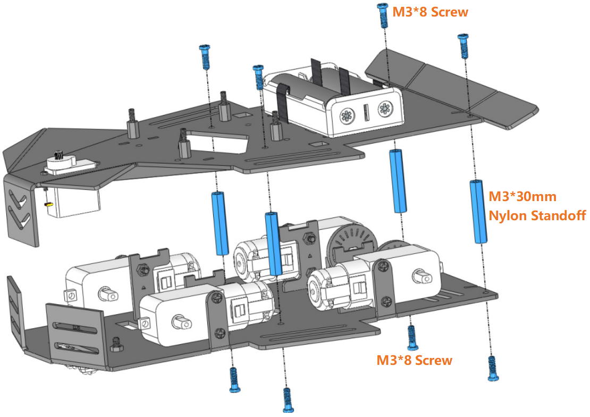

Assembling Spoiler
---------------------

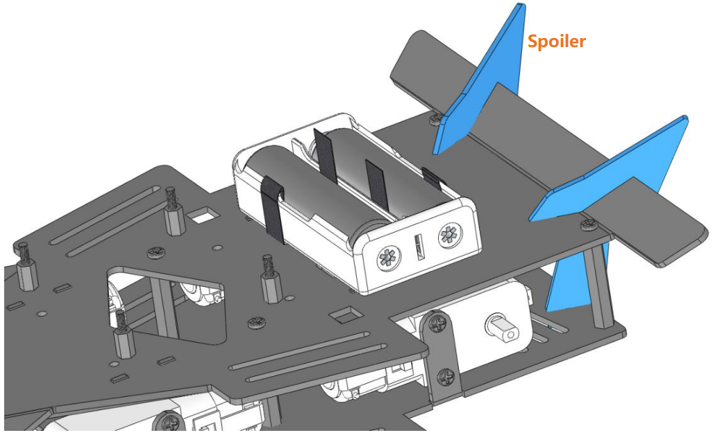

Assembling Control Board
----------------------------

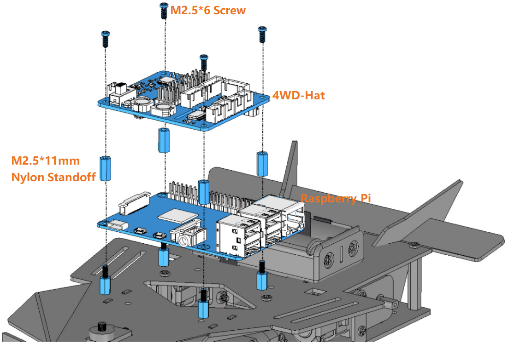

Connect Wires
------------------

Connect the modules properly with the guidance of the marks on the 4WD-Hat board.

.. note::
    For good appearance, you need to make sure that all the wires go through the bottom plate of the car to the HAT on the upper plate of the car.

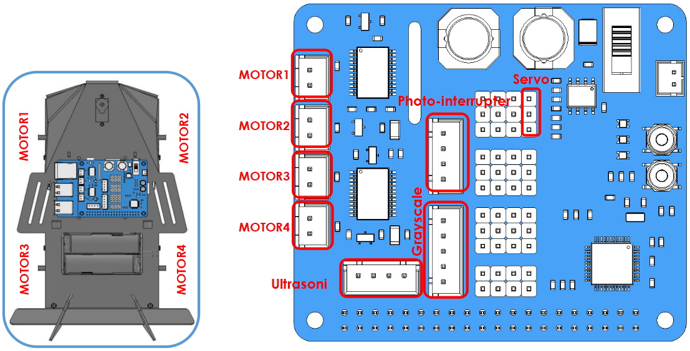

Assembling Radar Support
-----------------------------------

.. note::
    Assemble the servo arm only when the Raspberry Pi is energized and the command 「picar-4wd test servo」is running.

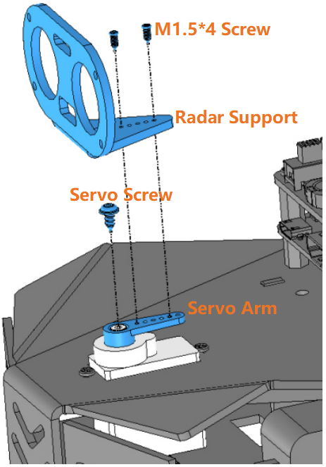

Assembling Ultrasonic Sensor Module
---------------------------------------

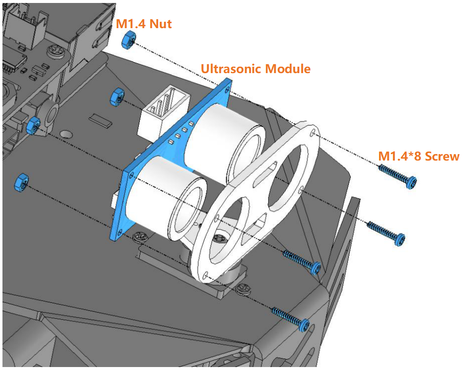

Assembling Wheels(finished)
-----------------------------

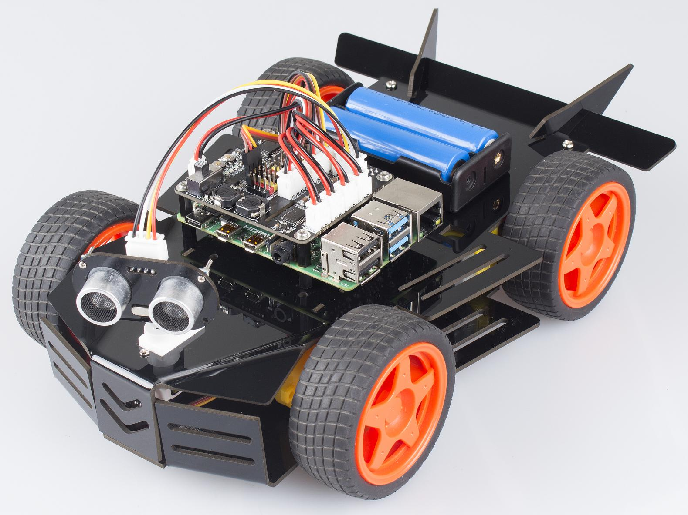

