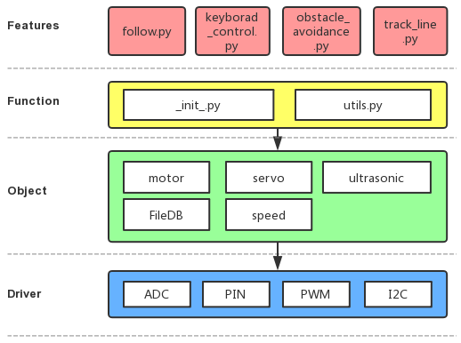

Python Example Code Analysis
==============================

Program Structure Framework
-----------------------------

 

keyboard_control.py
---------------------

In the code, we use readchar and readkey to get the input state of the key, then we assign some functions to the keys by using if statement.

.. note::
    You can **Modify/Reset/Copy/Run/Stop** the code below. But before that, you need to go to  source code path like ``picar-4wd/examples``. After modifying the code, you can run it directly to see the effect.

 

.. raw:: html

    <run></run>

.. code-block:: python

    import picar_4wd as fc
    import sys
    import tty
    import termios
    import asyncio

    power_val = 50
    key = 'status'
    print("If you want to quit.Please press q")
    def readchar():
        fd = sys.stdin.fileno()
        old_settings = termios.tcgetattr(fd)
        try:
            tty.setraw(sys.stdin.fileno())
            ch = sys.stdin.read(1)
        finally:
            termios.tcsetattr(fd, termios.TCSADRAIN, old_settings)
        return ch

    def readkey(getchar_fn=None):
        getchar = getchar_fn or readchar
        c1 = getchar()
        if ord(c1) != 0x1b:
            return c1
        c2 = getchar()
        if ord(c2) != 0x5b:
            return c1
        c3 = getchar()
        return chr(0x10 + ord(c3) - 65)

    def Keyborad_control():
        while True:
            global power_val
            key=readkey()
            if key=='6':
                if power_val <=90:
                    power_val += 10
                    print("power_val:",power_val)
            elif key=='4':
                if power_val >=10:
                    power_val -= 10
                    print("power_val:",power_val)
            if key=='w':
                fc.forward(power_val)
            elif key=='a':
                fc.turn_left(power_val)
            elif key=='s':
                fc.backward(power_val)
            elif key=='d':
                fc.turn_right(power_val)
            else:
                fc.stop()
            if key=='q':
                print("quit")  
                break  
    if __name__ == '__main__':
        Keyborad_control()
    

obstacle_avoidance.py
------------------------

In the code, the distance measurement radar (ultrasonic + servo) will take sample for 11 times in total (once every 18°). Then it makes judgement on the distance states of the fourth and the seventh sampling. If radar indicates no obstacle(the returned value is 2), the car will continue moving ahead, or else the car turn right to get around the obstacle.

.. note::
    Check \"scan_step()\", \"get_status_at()\" in the \"_init_.py\" for more details about the judgement on radar sampling and distance state.

 
.. raw:: html

    <run></run>

.. code-block:: python

    import picar_4wd as fc

    speed = 30

    def main():
        while True:
            scan_list = fc.scan_step(35)
            if not scan_list:
                continue

            tmp = scan_list[3:7]
            print(tmp)
            if tmp != [2,2,2,2]:
                fc.turn_right(speed)
            else:
                fc.forward(speed)

    if __name__ == "__main__":
        try: 
            main()
        finally: 
            fc.stop()

track_line.py
----------------

In this code, grayscale sensor module will judge the gray level of the floor under the car’s head. The car adjusts the directions according to the detection values of these three detectors to follow the black line.

.. note::
    About **Grayscale judgement**, refer to \"get_line_status()\" in \"_init_.py\" for more details.
    

.. raw:: html

    <run></run>

.. code-block:: python

    import picar_4wd as fc

    Track_line_speed = 20

    def Track_line():
        gs_list = fc.get_grayscale_list()
        if fc.get_line_status(400,gs_list) == 0:
            fc.forward(Track_line_speed) 
        elif fc.get_line_status(400,gs_list) == -1:
            fc.turn_left(Track_line_speed)
        elif fc.get_line_status(400,gs_list) == 1:
            fc.turn_right(Track_line_speed) 

    if __name__=='__main__':
        while True:
            Track_line()

follow.py
------------

In the code, the ultrasonic module will take sample to form an array containing 11 elements; the module detects once every 18° and puts the distance state (0，1，2) of every angle into the array. If there is something obstructive at the right front, the detection value is [22222211122].

The array takes the 2 as a delimiter to divide the array anew. The examples above will be divided into several null elements and a [111]- value element.

The corresponding angular range of the element with a value [111] is 108°~144° (0°+18°*6=108°, 0°+18°*8=144°), and the car will turn its angle into a median 126°（（144+108）/2）

Judge the distance, and keep the car away from the object about 10cm.

.. note::
    Refer to \"scan_step()\" and \"get_status_at()\" in \"_init_.py\" to get more details about radar sampling and the distance state judgement.

.. raw:: html

    <run></run>

.. code-block:: python

    import picar_4wd as fc

    speed = 30

    def main():
        while True:
            scan_list = fc.scan_step(23)
            # print(scan_list)
            if not scan_list:
                continue

            scan_list = [str(i) for i in scan_list]
            scan_list = "".join(scan_list)
            paths = scan_list.split("2")
            length_list = []
            for path in paths:
                length_list.append(len(path))
            # print(length_list)
            if max(length_list) == 0:
                fc.stop() 
            else:
                i = length_list.index(max(length_list))
                pos = scan_list.index(paths[i])
                pos += (len(paths[i]) - 1) / 2
                # pos = int(pos)
                delta = len(scan_list) / 3
                # delta *= us_step/abs(us_step)
                if pos < delta:
                    fc.turn_left(speed)
                elif pos > 2 * delta:
                    fc.turn_right(speed)
                else:
                    if scan_list[int(len(scan_list)/2-1)] == "0":
                        fc.backward(speed)
                    else:
                        fc.forward(speed)

    if __name__ == "__main__":
        try:
            main()
        finally:
            fc.stop()
