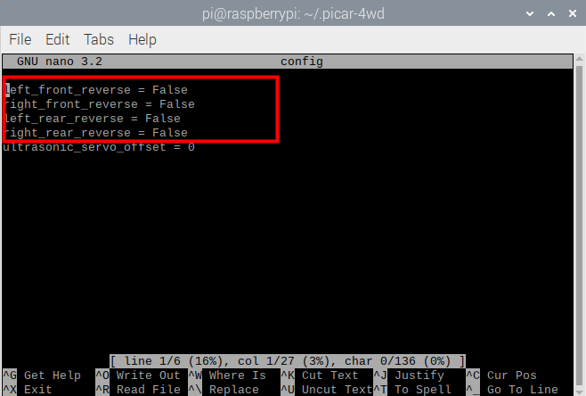

Motor Calibration
=================

Because of assembly methods and other reasons, your motor may still need a calibration direction. Otherwise, when the car moves forward, it may turn left, turn right, or even go backwards. Please follow the following steps to complete the calibration.

**How to do？**

1. Enter the examples folder. 

.. raw:: html

    <run></run>

.. code-block:: 

    cd /home/pi/picar-4wd/examples

2. Run the ``move_forward.py`` . This is a very simple example, which will let the car go forward.

.. raw:: html

    <run></run>

.. code-block:: 

    python3 move_forward.py

3. Observe whether the wheels of the car are driving forward and marked the wrong motor.

4. Open the configuration file.

.. raw:: html

    <run></run>

.. code-block:: 

    sudo nano /home/pi/.picar-4wd/config 

5. Change the reverse FLAG of the error motor from ``False`` to ``True``.

6. Run again ``move_forward.py``, if the car is driving correctly, the calibration is completed.

.. raw:: html

    <run></run>

.. code-block:: 

    python3 move_forward.py

