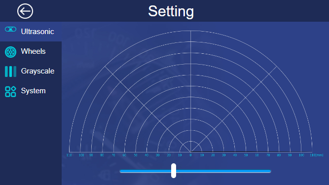
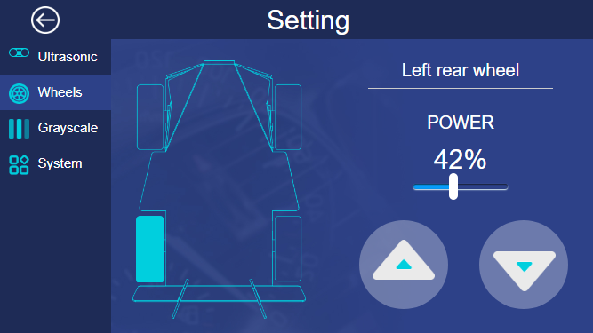
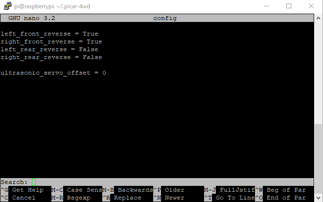
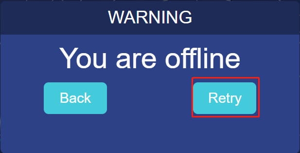
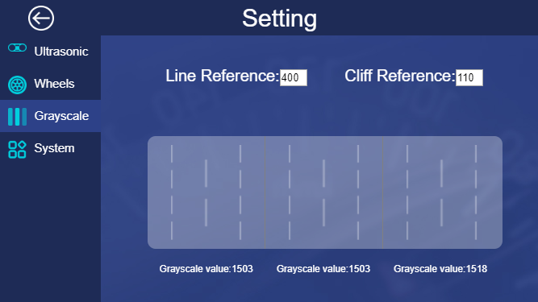
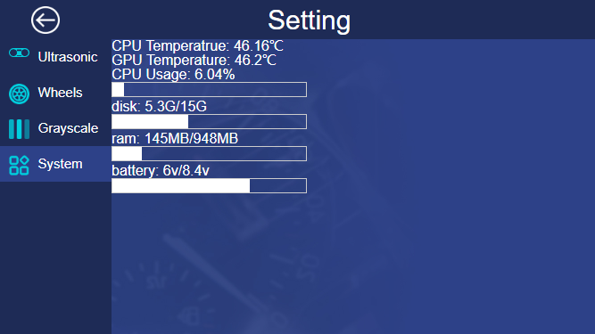

Setting Page
=============

Ultrasonic
-----------

This page is used to test whether the ultrasonic sensor works well. The slider below can be used to adjust the current direction and angle of the ultrasonic sensor.

Wheels
---------

You can test the working condition of the wheels on this page.

Click a wheel then set the POWER, click the two buttons in bottom right corner. When you press the button at left, the wheel goes forward; press the button on the right, the wheel go backward. If the car doesn’t follow your operation like that, you should adjust the direction. The methods are as follows: 

1) Input the following command to open the configure file.

.. code-block:: python

    cd ..
    ls -a
    cd .picar-4wd/
    nano config

2) In the configure file, the first 4 lines of codes are used to control the turning of the motor. The last line is used to adjust the angle of the servo. For example, if in the above test, the direction of the motor at bottom left is reverse, so we change the code in the third line to left_rear_reverse = **True**.

3) Rerun the following commands.

.. code-block:: python

    cd /home/pi/picar-4wd/
    picar-4wd web-example

4) In the browser, click Retry, and you can test the direction of the wheel ready to be used.

Grayscale
-----------

On this page, you can adjust the threshold of the line following and cliff detection.

**Line Reference**

Put the Picar-4wd on the white surface and record these three values of Grayscale. Now the value of Grayscale is large enough, about 1500. Then put the grayscale sensor module of Picar-4wd above the black surface and record these three values of Grayscale. Now, the value of Grayscale gets relatively small, about 150 as is predicted. So we set the value of Line Reference to 400. Of course, you can change the value. Once you finish doing this, you can see that the corresponding area turning into gray if the value of Grayscale is larger than 400; if not so, turning into black.

**Cliff Reference**

Put the car at the edge of the desk with the car’s head sticking out from the desk. Record three values of Grayscale, and now the value is relatively small, less than 100. Please set the value of Cliff Reference to 110. When you finish doing this, the corresponding area appears red exclamation symbol if the value of Grayscale is less than 110. 

System
---------

You can check the operating condition of the system on this page.

① Make the example program run automatically at startup.

.. code-block:: python

    picar-4wd web-example enable

② If you want to turn off the Start on Boot, please type in the following command.

.. code-block:: python

    picar-4wd web-example disable

