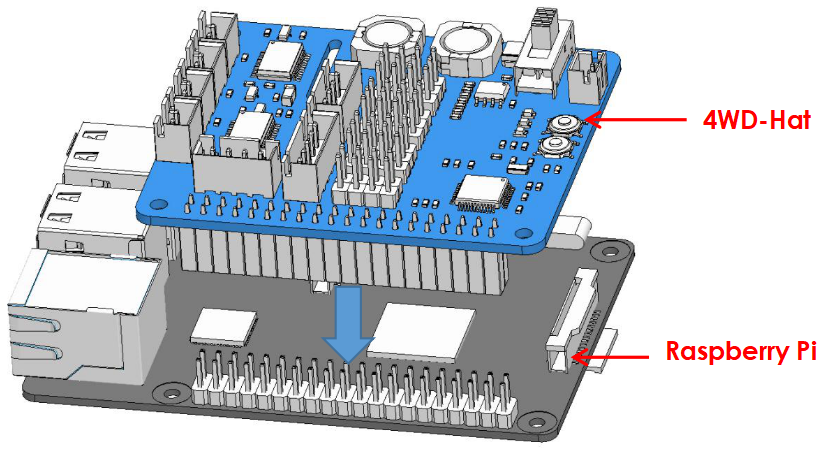
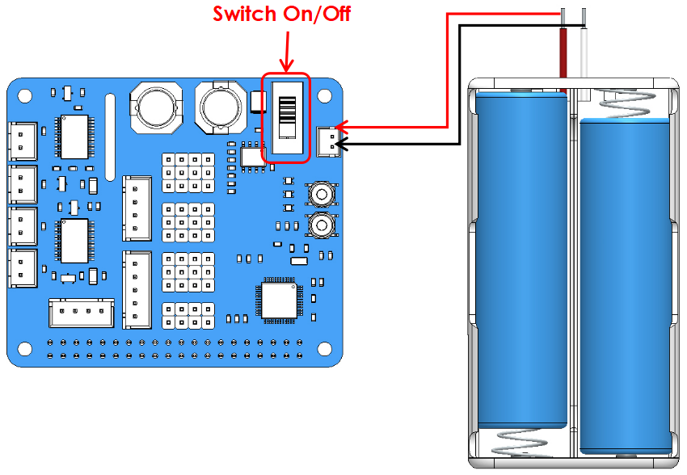
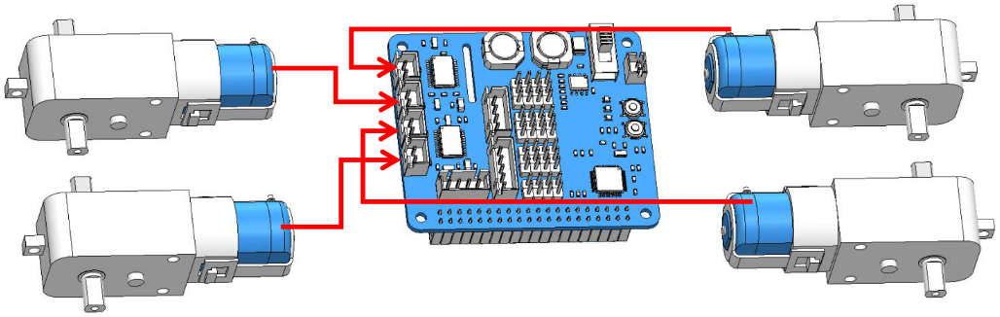
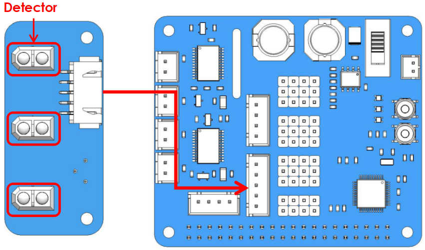
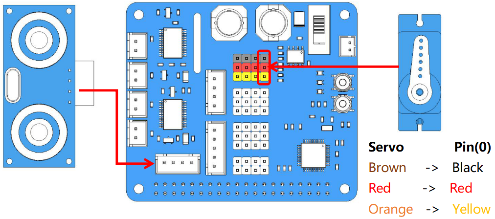

Test the Modules
=================

In case of anything wrong with the components, you can firstly debug them, then start your assembling and use. 

Initialize the Environment
-------------------------------

Initialize the environment before using the product example. The methods are as follows.

① Assemble 4WD-Hat and boot the Raspberry Pi.

.. note::
  Due to the long test time, you can also use an external power supply to power the Raspberry Pi at the same time. But 4WD-Hat can only be powered by battery, you can't just use external power supply without batterries, otherwise the following error will occur when you are running the command: **picar-4wd test motor**.

  ---- picar-4wd test motor returns OSError: [Errno 121] Remote I/O error ----

② Enter the folder picar-4wd.

.. code-block:: python

    cd /home/pi/picar-4wd/

③ Start up the initialization function.

.. code-block:: python

    sudo python3 setup.py install

The main functions of setup.py may be:

A. Download and configure necessary library files, including pip, sysstat, i2c-tools.
B. Provide entry points called「picar-4wd」to call the function of example code.

.. note::
    Initialization needs connecting to the internet and spending a lot of time. The final line will appear「finish」after configuration is finished.

Module Testing
------------------

To make sure that the module works well, you can test the module by these means.

① Testing the motor of the car.

Wire up the motor according to the diagram.

Input the command.

.. code-block:: python

    picar-4wd test motor

After you input the command, the four motors will last working till you press on Ctrl+C. Among the motors, two of them rotate clockwise, and the rest of them rotate anticlockwise.

② Testing the grayscale sensor module.

Finishing the wire up according to the diagram.

Input the following command.

.. code-block:: python

    picar-4wd test grayscale

After you input the command, the monitor will print the readings of three detectors of line-following module once.

③ Testing the servo and the ultrasonic module.

Start your wire up:

Input the commands:

.. code-block:: python

    picar-4wd test servo

The arm of servo will rotate to the angle of 0, meanwhile the monitor will print the readings of ultrasonic module once.

.. note::
    You need to boot this function to check the direction of servo’s output axis when you assemble the car and the servo.

Power Supply Detection
-------------------------

You can use the following command to get the supply voltage.

.. code-block:: python

    picar-4wd power-read

The supply voltage ought to be 6V~8.5V to ensure that the car works well.

Reset Controller
---------------------

If you encounter some errors during your use, for example, the car don’t make response to your control command of control terminal, you can try to reset HATS by using the following command.

.. code-block:: python

    picar-4wd soft-reset

